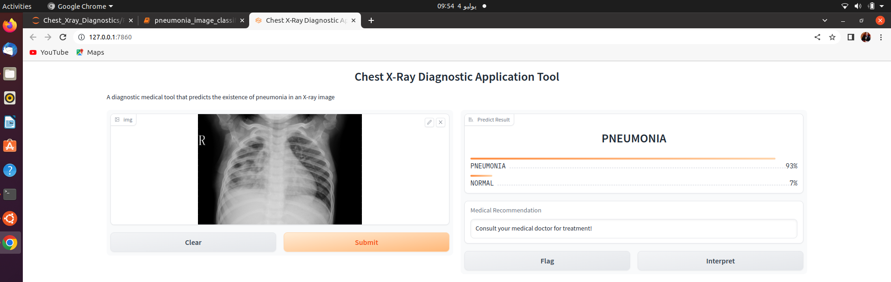

# Chest_Xray_Diagnostics

A pilot development of a chest X-ray diagnostic tool: This project entails the development  of a deep learning model 
for classifying an x-ray image containing pneumonia or not. 

# New version of the diagnostic model (Implemented in Pytorch)

The deep learning recognition model was build from modified ResNet-50 and the deployment was done on Gradio framework.

An ipython file  (pneumonia_image_classification_and_diagonstic.ipynb) was implemented and was used for training the ResNet-50 model (Implemented in Pytorch); the  *.ipynb contains program for;

* Training the deep learning model

* Evaluation of the deep learning classification report (Accuracy, Precision, F1-Score, and Recall)

* Display of confusion matrix for both testing and validation sets which yielded 87% accuracy after training for 25 epochs.

* Integration of application programming  interface (API) that support model prediction of pneumonia or not, and provide recommendation platform to consult a doctor or not for possible treatment protocol. 

model weights 'data_model_24.pt' (https://drive.google.com/file/d/1Kkw5d_a5LR0qQtfqtUgMymIoUMWihuU-/view?usp=sharing)

# Old version of the diagnostic model (Implemented in Tensorflow)

The deep learning recognition model was build from DenseNet121 and the deployment was done on Gradio framework. 

An ipython file  (DenseNet121_model_training.ipynb) was used for training the DenseNet121 model (Implemented in Tensorflow)

# Link to the model weights generated:

model weight: 'COVIDDenseNet121_10_epochs.h5' (https://drive.google.com/file/d/1TzgIrrI2-5jdMYo8z_VmtN2kDb9IqDBy/view?usp=sharing)

After training for 10 epochs, the trained model is 68% accurate at testing phase and could get better when the deep learning algorithm 
is trained for long time duration.

# Data Source
We employed the training set and testing set (treated as validation set since it contains sufficient amount of data) from the data 
within the link below were used when training the deep learning recognition model.

https://www.kaggle.com/datasets/paultimothymooney/chest-xray-pneumonia?resource=download

The validation data from the above link was treated as testing set in our experiment, this is because the amount of images were small 
(16 images divided into two equal part; whereby each class contains 8 images).

